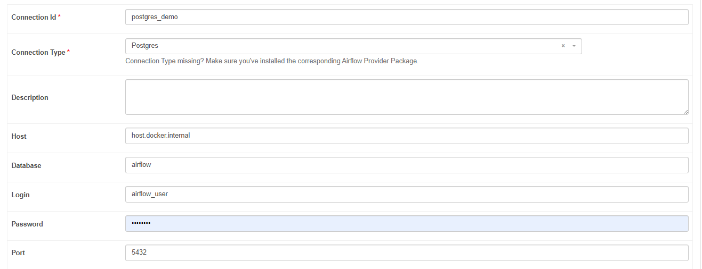
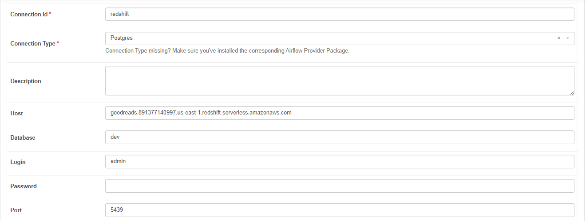
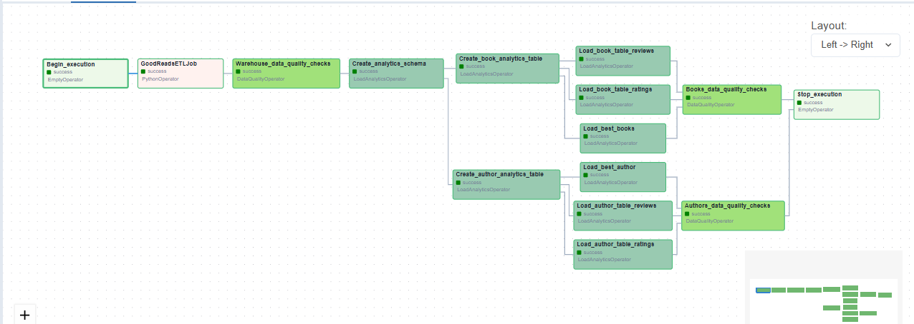
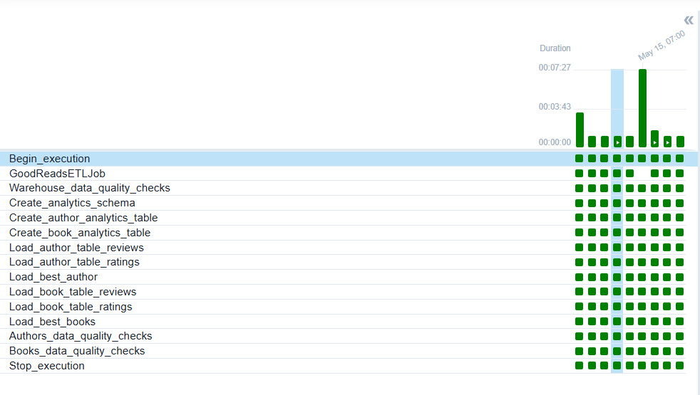

# Goodreads Pipeline and Recommendation System

Data is created and stored on local disk and moved to AWS S3. Perform ETL tasks and move data to AWS Redshift. Tasks are scheduled daily.

## ETL Workflow

- Data is moved to landing zone s3 buckets.
- ETL job has s3 module which copies data from landing zone to working zone.
- Once the data is moved to working zone, spark job is triggered which reads the data from working zone and apply transformation. Dataset is repartitioned and moved to the Processed Zone.
- Warehouse module of ETL jobs picks up data from processed zone and stages it into the Redshift staging tables.
- Using the Redshift staging tables and UPSERT operation is performed on the Data Warehouse tables to update the dataset.
- ETL job execution is completed once the Data Warehouse is updated.
- Airflow DAG runs the data quality check on all Warehouse tables once the ETL job execution is completed.
- Airflow DAG has Analytics queries configured in a Custom Designed Operator. These queries are run and again a Data Quality Check is done on some selected Analytics Table.
- Dag execution completes after these Data Quality check.

## Airflow Connect

Connect to PostgreSQL

Connect to AWS Redshift via PostgreSQL

## Workflow

## Run

